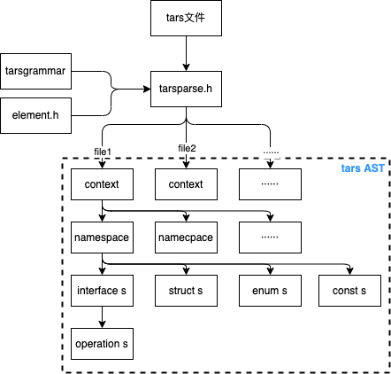
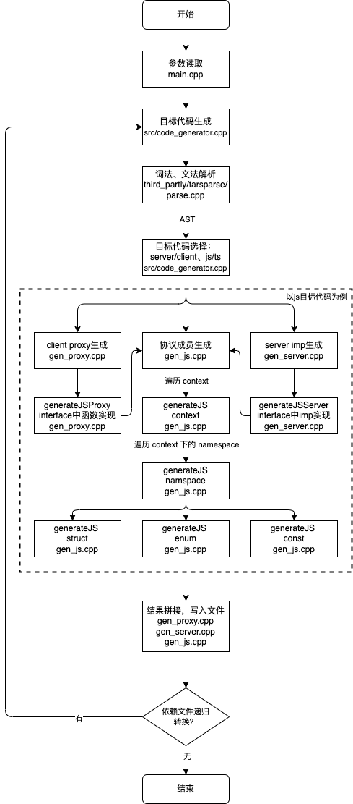

# 目录结构
```
.
├── bin               # 编译好的各平台可执行文件
├── src               # 入口&代码生成器，根据AST生成目标代码
└── third_partly
    ├── tarsgrammar   # tars协议文件的词法、文法定义（基于flex、bison）
    ├── tarsparse     # tars协议的parser，解析、转换tars协议文件，得到AST
    └── util          # 工具代码
```

# 工作流程
parse阶段和 generate阶段的的逻辑是重点。
## parse阶段
parse阶段的代码在 `third_partly` 目录中，主要工作是做tars协议词法/文法解析，并转换得到 AST。  
```
third_partly/
├── tarsgrammar
│   ├── tars.lex.cpp
│   ├── tars.tab.cpp
│   └── tars.tab.hpp
├── tarsparse
│   ├── element.cpp
│   ├── element.h
│   ├── parse.cpp
│   └── parse.h
└── util
```
`tarsparse/element.h` 中定义了 tars 协议的文法类型，包括：
- context —— 文件
- namespace —— 协议中的namespace
- interface —— 协议中的 interface
- operation —— interface 中的方法
- 各种数据结构 —— struct、map、vector、enum、各基本类型等

`tarsparse/parser.h` 为解析器入口，它调用 `tarsgrammar` 中的词法、文法解析器，得到 `tarsparse/element.h` 中定义的文法对象，即一个 AST 对象。   
下面是`tarsparse/parser.h`中定义的具体的解析结果，其中有 `context → namespace → interface/strcut/enum/const ` 这样的包含关系。

```c++
protected:
    bool                            _bWithTars;
    std::map<std::string, int>      _keywordMap;
    int                             _itab;
    StructPtr                       _key;
    std::stack<ContextPtr>          _contexts;
    std::stack<ContainerPtr>        _contains;
    std::vector<ContextPtr>         _vcontexts;
    std::vector<StructPtr>          _structs;
    std::vector<EnumPtr>            _enums;
    std::vector<NamespacePtr>       _namespaces;
    string                          _sHeader;
    bool                            _bUseCurrentPath;
    bool                            _bUseCurrentPathFirst;
    std::vector<string>             _vIncludePath;
```

下面是 parse阶段 流程的示意图。  


## generate阶段
generate阶段的代码在 `src` 目录中，主要工作是根据parse阶段得到的AST，生成不同的目标代码。  
```
src/
├── code_generator.cpp
├── code_generator.h          # 代码生成器
├── file_util.cpp
├── gen_js.cpp                # 生成js目标代码（struct + enum + const）
├── gen_js_dts.cpp            # 生成js目标时，可选生成dts声明文件
├── gen_proxy.cpp             # 生成js目标代码（client proxy）
├── gen_proxy_dts.cpp         # 生成js目标代码（client proxy）时，可选生成dts声明文件
├── gen_proxy_ts.cpp          # 生成ts目标代码（client proxy）
├── gen_server.cpp            # 生成js目标代码（server imp）
├── gen_server_dts.cpp        # 生成js目标代码（server imp）时，可选生成dts声明文件
├── gen_server_imp.cpp        # 生成js目标代码（server imp 用户实现的imp业务逻辑文件）
├── gen_server_ts.cpp         # 生成ts目标代码（server imp）
├── gen_server_ts_imp.cpp     # 生成ts目标代码（server imp 用户实现的imp业务逻辑文件）
├── gen_ts.cpp                # 生成ts目标代码（struct + enum + const）
├── idl_scan.cpp              # 工具函数 idl扫描，缓存一些信息
├── idl_util.cpp              # 工具函数
└── main.cpp                  # 整个程序入口
```

在开始生成代码之前，会根据输入选项从两个维度区分生成代码 —— 语言维度可以选择生成`ts/js`，逻辑维度可以选择生成 `主体成员/client/server`。其中主体成员是指协议中 namespace 包裹下，除了 interface 之外的部分， 包括 `struct、enum、const`。    
实际上 `ts/js` 的生成逻辑大同小异，而 `主体成员/client/server` 的生成路径略有差异，我们只需要挑一种进行分析，如分析js语言的生成过程。    

- `主体成员` 生成工作，只生成 `struct、enum、const`，不关注 interface 的实现。例如 `XXX.tars`，则会生成 `XXXTars.js`。    
- `client` 生成工作，会包含`主体成员` 生成工作，并且加上 interface 中所有函数的 `client proxy调用函数` 生成。例如 `XXX.tars`，则会生成 `XXXProxy.js`。    
- `server` 生成工作，会包含`主体成员` 生成工作，并且加上 interface 中所有函数的 `server imp处理函数` 生成，以及需要用户实现的 `imp 业务逻辑文件`。例如 `XXX.tars`，则会生成 `XXX.js` 和 `XXXImp.js`。     

```c++
if (!_bClient && !_bServer)
{
    if (_bTS)
    {
        generateTS(contexts[i]);                        // generate .ts
    }
    else
    {
        generateJS(contexts[i]);                        // generate .js
        if (_bDTS) generateDTS(contexts[i]);            // generate .d.ts
    }
}
// 转换客户端代码  XXXProxy.js
if (_bClient)
{
    //生成客户端时，需要为所有的 interface 添加 tars_ping 调用支持
    addTarsPingForProxy(contexts[i]);
    if (_bTS)
    {
        if (!generateTSProxy(contexts[i])) return;      // generate .ts for proxy classes
    }
    else
    {
        if (!generateJSProxy(contexts[i])) return;      // generate .js for proxy classes
        if (_bDTS) generateDTSProxy(contexts[i]);       // generate .d.ts for proxy classes
    }
}
// 转换服务端代码 XXXX.js 和 XXXImp.js
if (_bServer)
{
    if (_bTS)
    {
        if (!generateTSServer(contexts[i])) return;      // generate .ts for server classes
        generateTSServerImp(contexts[i]);                // generate .ts for server implementations
    }
    else
    {
        if (!generateJSServer(contexts[i])) return;      // generate .js for server classes
        if (_bDTS) generateDTSServer(contexts[i]);       // generate .d.ts for server classes
        generateJSServerImp(contexts[i]);                // generate .js for server implementations
    }
}
// 获取协议的依赖文件，递归转换
vector<string> files = contexts[i]->getIncludes();
for (size_t ii = 0; _bRecursive && ii < files.size(); ii++)
{
    // 递归生成
}
```

下面是 整个 generate 流程的示意图。   
